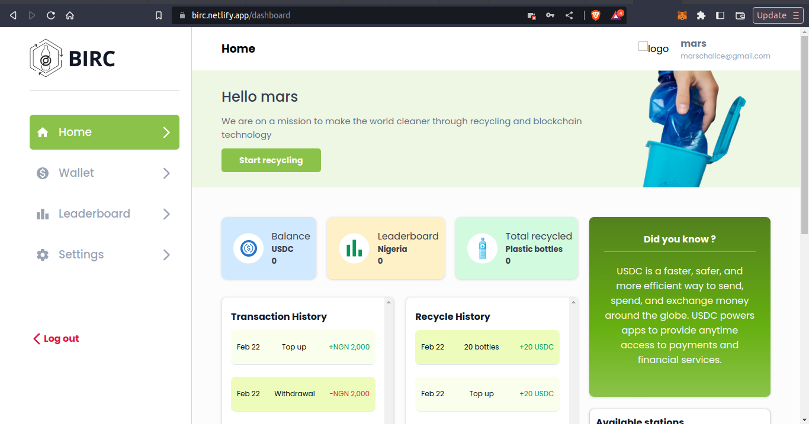
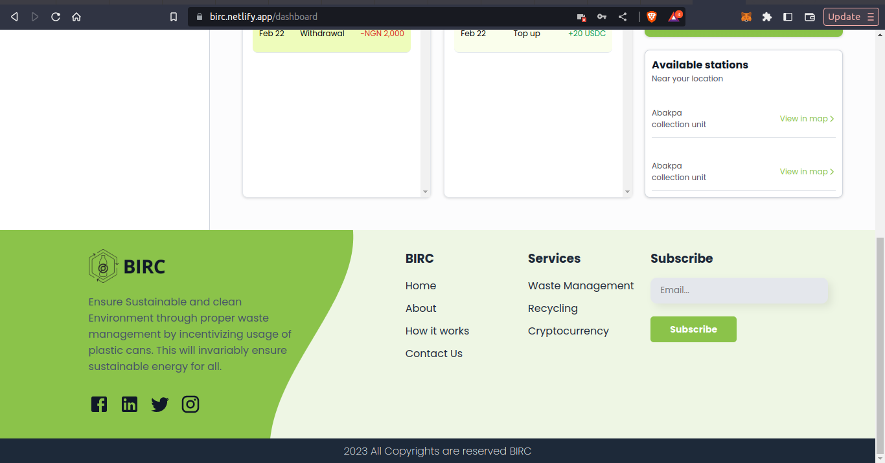
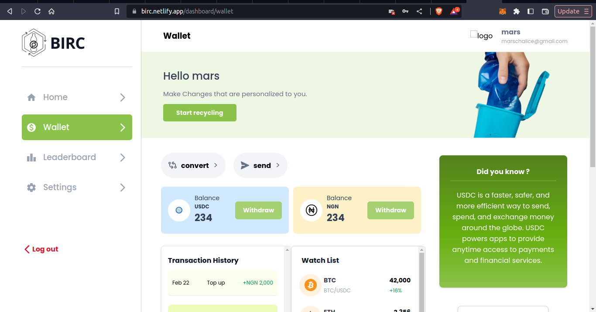

# Waste Management System

## Description

Our waste management system utilizes Circle API to reward users with incentives for recycling a specified number of pet bottles.
By encouraging recycling, we aim to promote a cleaner environment and reduce waste in landfills. Our system provides a simple and efficient way for users to participate in sustainable practices and receive tangible benefits for their efforts.
These incentives can then be used in our marketplace to purchase items as the user may wish.

## Live Demo

https://birc.netlify.app/

## Usage

- To use this app use the link of the deployed app, [BIRC](https://birc.netlify.app/) or clone the repository and cd into the directory such that you are on `client`
- To run this code, make sure you have [nodejs](https://nodejs.org) or [yarn](https://yarnpkg.com/) installed
- use the following command to run the code on your terminal

```bash
- install the needed dependency

#npm install

npm install

#yarn install

yarn install


- run the App locally

#npm run dev

npm run dev

# yarn dev

yarn dev

```

## Overview of User Dashboard

### Home

- This shows the users dashboard on the Home Page
  

  

### Wallet

- This shows the users dashboard on the wallet Page




## Further Improvement

This is the first version of our Project and the following features will be coming implemented in the second version.

- IoT Count: An IoT device for real time counting of the plastics bottles and sending the counts onchain to be used by the priceFeeds for accurate conversion to local and cryptocurrencies.

- Price Feed: Oracles for external computations and price Feeds and value rate conversions will be implemented.

- Market Place: We are going to implement marketplace to that the users of our application can easily use the fund they get from recycling to buy something of their choice, if they don't want to convert it to their local currency.

- Leader board Badges: We already have leader boards thus we are going to add badges, levels challenges to it to encourage users to recycle more.
  Upon successful registration every user will have a default badge if they have verified their account.
  There is going to be an Algorithm that will auto push user to new level on the leader board and give them new badges based on the number of plastics bottles they have been able to recycle by using our application.

- Tokenization of Badges: To incentivize users for active recycling of plastics bottles, each badge will be tokenized and the token can be swapped with USDC or used to buy items in our market place.

- Sharing Feature: This feature will allow users to share their progress with the community, friends or in social media platforms, showing how they are actively contributing to sustainable environment for all by recycling.

- Educational Forum: The educational forum will be implemented so as to raise awareness about waste management, recycling best practice for environmental sustainability. Education videos and contents will be made available here and users will be rewarded for finishing any of the module.

- Environment Impact Assessment Card: An impact measurement feature will be added on the users dashboard, this will be give users the visuals of the positive impact they have made through their recycling efforts like example displaying waste diverted from certain areas or even pollution that was prevented through their recycling efforts. The Environment Impact Assessment Card will be sharable online or on social media.

## License

[MIT](https://choosealicense.com/licenses/mit/)
